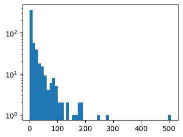
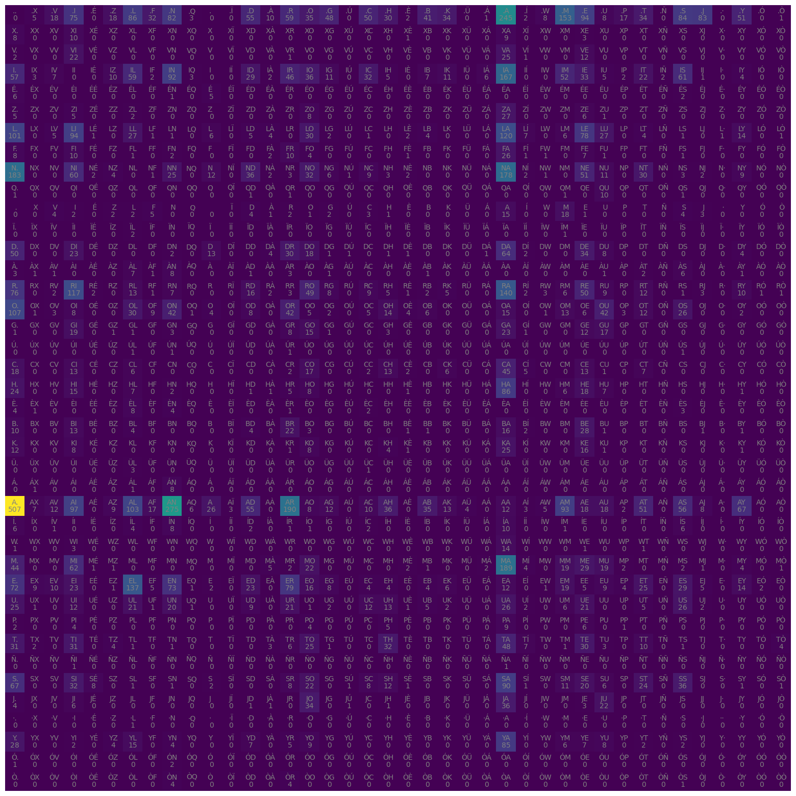

```python
import pandas as pd
import numpy as np
import matplotlib.pyplot as plt
import torch
```

### Fer MESNOMS

MESNOMS una IA que agafa noms de persona en català i crea nous noms basats en com estan construits. Això es pot fer mitjançant un model simple de correlacions a dos caracters o via una xarxa neuronal. Aquí es fan les dues coses per poder comparar.

#### 0) Dades


```python
# We take the downloaded data from https://www.idescat.cat/noms/
words = open("noms.csv", "r").read().splitlines()

# Fix the first name
words[0] = words[0][1:]
```


```python
len(words), min(len(w) for w in words), max(len(w) for w in words)
```


    (1464, 2, 18)


#### 1) Bigram model

Per cada nom, lo que mirarem es que quina probabilitiat hi ha que cada lletra vagi darrere de una altra. I darrere de quina es mes probable que el nom acabi. Aquesta serà la mentalitat a lhora de construir el model.


```python
b = {}
for w in words:
    chs = ["<s>"] + list(w) + ["<e>"]   # We create two characters that say when name start and ends.
                                        # To account which characters are more likely to start and end.
    for ch1, ch2 in zip(chs,chs[1:]):   #We iterate the bigrams (pairs of consecutive chs)
        #print(ch1, ch2)
        bigram = (ch1,ch2)
        b[bigram] = b.get(bigram,0) + 1
```


```python
# Plot the histogram of bigrams

fig, ax = plt.subplots(figsize=(4,3))
ax.hist(b.values(), bins=50, log=True);
```


    

    


```python
# Let me first define an alphabet of the text, so the number of different characters in our dataset

alphabet = list(set("".join(words)))

# and we include the start and end characters
alphabet.insert(0, ".")

print("Alphabet size:", len(alphabet))

chars = list(alphabet)
```

    Alphabet size: 40
    


```python
# And now can represent the bigrams frequency in a two dimensional array using Pytorch

N = torch.zeros((len(alphabet),len(alphabet)), dtype=torch.int32)

char_to_idx = {ch: i for i,ch in enumerate(chars)}
```


```python
for w in words:
    chs = ["."] + list(w) + ["."] 
    for ch1, ch2 in zip(chs,chs[1:]):   #We iterate the bigrams (pairs of consecutive chs)
        id1 = char_to_idx[ch1]
        id2 = char_to_idx[ch2]
        N[id1,id2] += 1
```


```python
fig, ax = plt.subplots(figsize=(20,20))
plt.imshow(N)

idx_to_char = {i: ch for i,ch in enumerate(chars)}

for i in range(len(chars)):
    for j in range(len(chars)):
        chstr = idx_to_char[i] + idx_to_char[j]
        plt.text(j, i, N[i,j].item(), ha='center', va='top', color='gray')
        plt.text(j, i, chstr, ha='center', va='bottom', color='gray')
plt.axis('off')
```


    (-0.5, 39.5, 39.5, -0.5)


    

    


```python
# Now, to choose the starting character of a name, we can use the first row of the matrix N

p = N[0,:].float() / N[0,:].sum()   # We normalize the first row to get a probability distribution
```


```python
# We can now sample a character from this distribution

g = torch.Generator().manual_seed(420)

idx_word = torch.multinomial(p, 1, replacement=True, generator=g).item()
print("Initial character ", idx_to_char[idx_word])
```

    Initial character  A
    


```python
# Now we can generate a name by sampling characters from the bigram matrix

def generate_name(N, idx_to_char, g):
    ix = 0
    name = ""
    while True:
        p = N[ix,:].float() / N[ix,:].sum()
        ix = torch.multinomial(p, 1, replacement=True, generator=g).item()
        ch = idx_to_char[ix]
        name += ch
        if ix == 0:
            break
    return name
```


```python
for _ in range(10):
    print(generate_name(N, idx_to_char, g))
```

    OLOFOR.
    R.
    A.
    VERI.
    FIANDIEVAIA.
    EHARAD.
    CID.
    NA.
    SAIMESÉ JAL A.
    IBREU.
    

I veiem que això realment es terrible, tot i que ens ha sortit un CID, nom que existia en el passat :)

El problema en aquest cas es que simplement el model de bigrams es dolent, no podem nomes basarnos en això per fer noms, hi ha mes correlacions que no només correlacions a parells de lletres.


```python
# Now we can compute the log-likelihood of a name using the bigram model.

log_likelihood = 0
n = 0

for w in words:
    chs = ["."] + list(w) + ["."]
    for ch1, ch2 in zip(chs,chs[1:]):
        id1 = char_to_idx[ch1]
        id2 = char_to_idx[ch2]
        log_likelihood += torch.log(N[id1,id2].float() / N[id1,:].sum())
        n += 1

print("Log-likelihood per character:", log_likelihood.item() / n)
nll = -log_likelihood.item() / n
print("Negative log-likelihood per character:", nll) # The lower the better, it is a measure of how well the model fits the data
```

    Log-likelihood per character: -2.4189646583522495
    Negative log-likelihood per character: 2.4189646583522495
    

#### 2) Bigram Neural network model

Per cada nom, lo que mirarem es que quina probabilitiat hi ha que cada lletra vagi darrere de una altra. I entrenarem una xarxa neuronal que ens digui quina lletra hauria d'anar despres de cada una. 


```python
# Create the training set of bigrams

xs, ys = [], []

for w in words:
    chs  = ["."] + list(w) + ["."]
    for ch1, ch2 in zip(chs,chs[1:]):
        xs.append(char_to_idx[ch1])
        ys.append(char_to_idx[ch2])

xs = torch.tensor(xs)
ys = torch.tensor(ys)

# We transform the input data of the first character (xs) to a one-hot encoding
X = torch.nn.functional.one_hot(xs, num_classes=len(alphabet)).float()
```


```python
# We initialize the weights of the model
W = torch.randn((len(alphabet), len(alphabet)), requires_grad=True, generator=g)   # The first dimension is the input, the second is the output
```


```python
# Now the question is: How to train the model such that the weights W are such that the probability of the next character is the one that minimizes the negative log-likelihood?    

# Forward pass
logits = X @ W # We interpret the muliplication as the logarithm of the probability of the next character
# We can now compute the probability of the next character
prob = logits.exp() / logits.exp().sum(dim=1, keepdim=True) # This is the softmax function
loss = -prob[torch.arange(len(ys)), ys].log().mean()  # This is the negative log-likelihood
print(loss.item())

# Now we need to do Backward pass to compute the gradients of the loss with respect to the weights
W.grad = None # We need to reset the gradients to zero
loss.backward() # It computes the gradients of the loss with respect to the weights and stores them in W.grad

# And we can now update the weights using the gradients
W.data += - 0.01 * W.grad
```

    4.218803405761719
    


```python
# We can now train the model for a few epochs

h = 5 # Learning rate

for epoch in range(2000):
    logits = X @ W
    prob = logits.exp() / logits.exp().sum(dim=1, keepdim=True)
    loss = -prob[torch.arange(len(ys)), ys].log().mean() #+ 0.01 * W.pow(2).sum() # We can add a L2 regularization term to avoid overfitting
    W.grad = None
    loss.backward()
    W.data += - h * W.grad 
    print(epoch, loss.item())
```

    0 4.218803405761719
    1999 2.4291226863861084
    2000 2.4291207790374756


```python
# Now we can generate names using the trained model

for _ in range(10):
    idx_word = 0
    name = ""
    while True:
        xenc = torch.nn.functional.one_hot(torch.tensor([idx_word]), num_classes=len(alphabet)).float()
        logits = xenc @ W
        prob = logits.exp() / logits.exp().sum()
        
        ix = torch.multinomial(prob, 1, replacement=True).item()
        ch = idx_to_char[ix]
        name += ch
        idx_word = ix
        if ix == 0:
            break
    print(name)
```

    KÈ.
    SON.
    FSIANTELOU.
    AIN.
    COÍSTA.
    MA.
    ND.
    AN.
    HRO.
    EYDELA.
    

I el resultat torna a ser dolent, perque al final estem fent tambe un model de bigrams, aixi que no ens donarà tampoc millor que al original. Pero la loss function almenys (amb moltes epochs) es pot reduir a valors raonables.


```python

```
