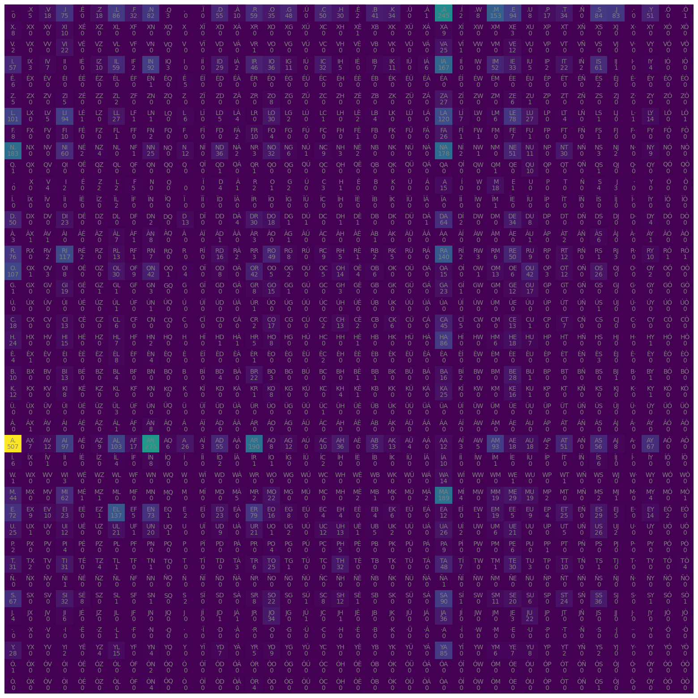

```python
import pandas as pd
import numpy as np
import matplotlib.pyplot as plt
import torch
```

### Fer MESNOMS

MESNOMS una IA que agafa noms de persona en català i crea nous noms basats en com estan construits. Això es pot fer mitjançant un model simple de correlacions a dos caracters o via una xarxa neuronal. Aquí es fan les dues coses per poder comparar.

#### 0) Dades


```python
# We take the downloaded data from https://www.idescat.cat/noms/
words = open("noms.csv", "r").read().splitlines()

# Fix the first name
words[0] = words[0][1:]
```


```python
len(words), min(len(w) for w in words), max(len(w) for w in words)
```


    (1464, 2, 18)


#### 1) Bigram model

Per cada nom, lo que mirarem es que quina probabilitiat hi ha que cada lletra vagi darrere de una altra. I darrere de quina es mes probable que el nom acabi. Aquesta serà la mentalitat a lhora de construir el model.


```python
b = {}
for w in words:
    chs = ["<s>"] + list(w) + ["<e>"]   # We create two characters that say when name start and ends.
                                        # To account which characters are more likely to start and end.
    for ch1, ch2 in zip(chs,chs[1:]):   #We iterate the bigrams (pairs of consecutive chs)
        #print(ch1, ch2)
        bigram = (ch1,ch2)
        b[bigram] = b.get(bigram,0) + 1
```


```python
# Plot the histogram of bigrams

fig, ax = plt.subplots(figsize=(4,3))
ax.hist(b.values(), bins=50, log=True);
```


    

    


```python
# Let me first define an alphabet of the text, so the number of different characters in our dataset

alphabet = list(set("".join(words)))

# and we include the start and end characters
alphabet.insert(0, ".")

print("Alphabet size:", len(alphabet))

chars = list(alphabet)
```

    Alphabet size: 40
    


```python
# And now can represent the bigrams frequency in a two dimensional array using Pytorch

N = torch.zeros((len(alphabet),len(alphabet)), dtype=torch.int32)

char_to_idx = {ch: i for i,ch in enumerate(chars)}
```


```python
for w in words:
    chs = ["."] + list(w) + ["."] 
    for ch1, ch2 in zip(chs,chs[1:]):   #We iterate the bigrams (pairs of consecutive chs)
        id1 = char_to_idx[ch1]
        id2 = char_to_idx[ch2]
        N[id1,id2] += 1
```


```python
fig, ax = plt.subplots(figsize=(20,20))
plt.imshow(N)

idx_to_char = {i: ch for i,ch in enumerate(chars)}

for i in range(len(chars)):
    for j in range(len(chars)):
        chstr = idx_to_char[i] + idx_to_char[j]
        plt.text(j, i, N[i,j].item(), ha='center', va='top', color='gray')
        plt.text(j, i, chstr, ha='center', va='bottom', color='gray')
plt.axis('off')
```


    (-0.5, 39.5, 39.5, -0.5)


    

    


```python
# Now, to choose the starting character of a name, we can use the first row of the matrix N

p = N[0,:].float() / N[0,:].sum()   # We normalize the first row to get a probability distribution
```


```python
# We can now sample a character from this distribution

g = torch.Generator().manual_seed(420)

idx_word = torch.multinomial(p, 1, replacement=True, generator=g).item()
print("Initial character ", idx_to_char[idx_word])
```

    Initial character  A
    


```python
# Now we can generate a name by sampling characters from the bigram matrix

def generate_name(N, idx_to_char, g):
    ix = 0
    name = ""
    while True:
        p = N[ix,:].float() / N[ix,:].sum()
        ix = torch.multinomial(p, 1, replacement=True, generator=g).item()
        ch = idx_to_char[ix]
        name += ch
        if ix == 0:
            break
    return name
```


```python
for _ in range(10):
    print(generate_name(N, idx_to_char, g))
```

    OLOFOR.
    R.
    A.
    VERI.
    FIANDIEVAIA.
    EHARAD.
    CID.
    NA.
    SAIMESÉ JAL A.
    IBREU.
    

I veiem que això realment es terrible, tot i que ens ha sortit un CID, nom que existia en el passat :)

El problema en aquest cas es que simplement el model de bigrams es dolent, no podem nomes basarnos en això per fer noms, hi ha mes correlacions que no només correlacions a parells de lletres.


```python
# Now we can compute the log-likelihood of a name using the bigram model.

log_likelihood = 0
n = 0

for w in words:
    chs = ["."] + list(w) + ["."]
    for ch1, ch2 in zip(chs,chs[1:]):
        id1 = char_to_idx[ch1]
        id2 = char_to_idx[ch2]
        log_likelihood += torch.log(N[id1,id2].float() / N[id1,:].sum())
        n += 1

print("Log-likelihood per character:", log_likelihood.item() / n)
nll = -log_likelihood.item() / n
print("Negative log-likelihood per character:", nll) # The lower the better, it is a measure of how well the model fits the data
```

    Log-likelihood per character: -2.4189646583522495
    Negative log-likelihood per character: 2.4189646583522495
    

#### 2) Bigram Neural network model

Per cada nom, lo que mirarem es que quina probabilitiat hi ha que cada lletra vagi darrere de una altra. I entrenarem una xarxa neuronal que ens digui quina lletra hauria d'anar despres de cada una. 


```python
# Create the training set of bigrams

xs, ys = [], []

for w in words:
    chs  = ["."] + list(w) + ["."]
    for ch1, ch2 in zip(chs,chs[1:]):
        xs.append(char_to_idx[ch1])
        ys.append(char_to_idx[ch2])

xs = torch.tensor(xs)
ys = torch.tensor(ys)

# We transform the input data of the first character (xs) to a one-hot encoding
X = torch.nn.functional.one_hot(xs, num_classes=len(alphabet)).float()
```


```python
# We initialize the weights of the model
W = torch.randn((len(alphabet), len(alphabet)), requires_grad=True, generator=g)   # The first dimension is the input, the second is the output
```


```python
# Now the question is: How to train the model such that the weights W are such that the probability of the next character is the one that minimizes the negative log-likelihood?    

# Forward pass
logits = X @ W # We interpret the muliplication as the logarithm of the probability of the next character
# We can now compute the probability of the next character
prob = logits.exp() / logits.exp().sum(dim=1, keepdim=True) # This is the softmax function
loss = -prob[torch.arange(len(ys)), ys].log().mean()  # This is the negative log-likelihood
print(loss.item())

# Now we need to do Backward pass to compute the gradients of the loss with respect to the weights
W.grad = None # We need to reset the gradients to zero
loss.backward() # It computes the gradients of the loss with respect to the weights and stores them in W.grad

# And we can now update the weights using the gradients
W.data += - 0.01 * W.grad
```

    4.218803405761719
    


```python
# We can now train the model for a few epochs

h = 5 # Learning rate

for epoch in range(1000):
    logits = X @ W
    prob = logits.exp() / logits.exp().sum(dim=1, keepdim=True)
    loss = -prob[torch.arange(len(ys)), ys].log().mean() #+ 0.01 * W.pow(2).sum() # We can add a L2 regularization term to avoid overfitting
    W.grad = None
    loss.backward()
    W.data += - h * W.grad 
    print(epoch, loss.item())
```

    0 2.429124355316162
    1 2.4291226863861084
    2 2.4291207790374756
    3 2.429119110107422
    4 2.429117441177368
    5 2.4291157722473145
    6 2.4291138648986816
    7 2.429112434387207
    8 2.429110527038574
    9 2.4291088581085205
    10 2.429107427597046
    11 2.429105520248413
    12 2.4291038513183594
    13 2.4291021823883057
    14 2.429100513458252
    15 2.429098606109619
    16 2.4290969371795654
    17 2.4290952682495117
    18 2.429093837738037
    19 2.4290921688079834
    20 2.4290902614593506
    21 2.429088830947876
    22 2.429086923599243
    23 2.4290852546691895
    24 2.429084062576294
    25 2.429081916809082
    26 2.4290802478790283
    27 2.4290785789489746
    28 2.429076910018921
    29 2.429075002670288
    30 2.4290735721588135
    31 2.4290719032287598
    32 2.429070234298706
    33 2.4290685653686523
    34 2.4290666580200195
    35 2.429065227508545
    36 2.429063320159912
    37 2.4290616512298584
    38 2.429060220718384
    39 2.429058313369751
    40 2.4290566444396973
    41 2.4290547370910645
    42 2.42905330657959
    43 2.429051399230957
    44 2.4290497303009033
    45 2.4290480613708496
    46 2.429046154022217
    47 2.429044723510742
    48 2.4290435314178467
    49 2.4290413856506348
    50 2.429039716720581
    51 2.4290382862091064
    52 2.4290363788604736
    53 2.42903470993042
    54 2.429033041000366
    55 2.4290313720703125
    56 2.429029703140259
    57 2.429028034210205
    58 2.4290266036987305
    59 2.4290246963500977
    60 2.429023027420044
    61 2.4290215969085693
    62 2.4290199279785156
    63 2.429018020629883
    64 2.429016351699829
    65 2.4290146827697754
    66 2.4290130138397217
    67 2.429011344909668
    68 2.4290096759796143
    69 2.4290080070495605
    70 2.429006338119507
    71 2.429004669189453
    72 2.4290032386779785
    73 2.429001569747925
    74 2.428999662399292
    75 2.4289979934692383
    76 2.4289963245391846
    77 2.428994655609131
    78 2.428992986679077
    79 2.4289915561676025
    80 2.428989887237549
    81 2.428988218307495
    82 2.4289863109588623
    83 2.4289846420288086
    84 2.428982973098755
    85 2.428981304168701
    86 2.4289798736572266
    87 2.428978204727173
    88 2.428976535797119
    89 2.4289748668670654
    90 2.428973436355591
    91 2.428971290588379
    92 2.4289698600769043
    93 2.4289681911468506
    94 2.428966760635376
    95 2.4289650917053223
    96 2.4289629459381104
    97 2.4289615154266357
    98 2.428959846496582
    99 2.4289581775665283
    100 2.4289565086364746
    101 2.428955078125
    102 2.4289534091949463
    103 2.4289517402648926
    104 2.4289498329162598
    105 2.428948402404785
    106 2.4289467334747314
    107 2.4289445877075195
    108 2.428943395614624
    109 2.4289419651031494
    110 2.4289402961730957
    111 2.428938627243042
    112 2.4289369583129883
    113 2.4289352893829346
    114 2.428933620452881
    115 2.428931713104248
    116 2.4289302825927734
    117 2.4289286136627197
    118 2.428926944732666
    119 2.4289252758026123
    120 2.4289236068725586
    121 2.428921937942505
    122 2.4289205074310303
    123 2.4289186000823975
    124 2.4289169311523438
    125 2.428915500640869
    126 2.4289138317108154
    127 2.4289121627807617
    128 2.428910493850708
    129 2.4289088249206543
    130 2.4289071559906006
    131 2.428905487060547
    132 2.428903818130493
    133 2.4289021492004395
    134 2.4289004802703857
    135 2.428899049758911
    136 2.4288971424102783
    137 2.4288957118988037
    138 2.42889404296875
    139 2.4288923740386963
    140 2.428891181945801
    141 2.428889036178589
    142 2.4288876056671143
    143 2.4288859367370605
    144 2.428884267807007
    145 2.4288828372955322
    146 2.4288809299468994
    147 2.428879499435425
    148 2.428877830505371
    149 2.4288761615753174
    150 2.4288744926452637
    151 2.42887282371521
    152 2.4288713932037354
    153 2.4288697242736816
    154 2.428867816925049
    155 2.428866386413574
    156 2.4288647174835205
    157 2.428863048553467
    158 2.428861379623413
    159 2.4288599491119385
    160 2.4288582801818848
    161 2.428856372833252
    162 2.4288547039031982
    163 2.4288530349731445
    164 2.42885160446167
    165 2.428849935531616
    166 2.4288482666015625
    167 2.428846836090088
    168 2.428845167160034
    169 2.4288434982299805
    170 2.4288418292999268
    171 2.428840398788452
    172 2.4288384914398193
    173 2.4288368225097656
    174 2.428835391998291
    175 2.4288339614868164
    176 2.4288320541381836
    177 2.428830146789551
    178 2.428828716278076
    179 2.4288275241851807
    180 2.428825616836548
    181 2.4288241863250732
    182 2.4288225173950195
    183 2.428821086883545
    184 2.4288196563720703
    185 2.4288179874420166
    186 2.4288158416748047
    187 2.42881441116333
    188 2.4288129806518555
    189 2.428811550140381
    190 2.428809642791748
    191 2.4288079738616943
    192 2.4288063049316406
    193 2.428804874420166
    194 2.428802728652954
    195 2.4288015365600586
    196 2.428800106048584
    197 2.4287984371185303
    198 2.4287967681884766
    199 2.428795099258423
    200 2.4287936687469482
    201 2.4287919998168945
    202 2.428790330886841
    203 2.428788661956787
    204 2.4287869930267334
    205 2.428785562515259
    206 2.428783893585205
    207 2.4287822246551514
    208 2.4287807941436768
    209 2.428779363632202
    210 2.4287774562835693
    211 2.4287757873535156
    212 2.428774118423462
    213 2.4287726879119873
    214 2.4287710189819336
    215 2.428769111633301
    216 2.428767681121826
    217 2.4287662506103516
    218 2.428764581680298
    219 2.428762912750244
    220 2.4287614822387695
    221 2.428759813308716
    222 2.428758144378662
    223 2.4287564754486084
    224 2.428755044937134
    225 2.428753137588501
    226 2.4287519454956055
    227 2.4287500381469727
    228 2.428748607635498
    229 2.4287471771240234
    230 2.4287455081939697
    231 2.428744077682495
    232 2.4287424087524414
    233 2.4287407398223877
    234 2.428739070892334
    235 2.4287376403808594
    236 2.4287359714508057
    237 2.428734302520752
    238 2.4287326335906982
    239 2.4287312030792236
    240 2.42872953414917
    241 2.428727865219116
    242 2.4287264347076416
    243 2.428724765777588
    244 2.4287233352661133
    245 2.4287216663360596
    246 2.428719997406006
    247 2.4287185668945312
    248 2.4287168979644775
    249 2.428715467453003
    250 2.42871356010437
    251 2.4287123680114746
    252 2.428710460662842
    253 2.428709030151367
    254 2.4287075996398926
    255 2.428705930709839
    256 2.428704261779785
    257 2.4287025928497314
    258 2.4287009239196777
    259 2.4286997318267822
    260 2.4286978244781494
    261 2.428696393966675
    262 2.4286949634552
    263 2.4286932945251465
    264 2.4286916255950928
    265 2.428689956665039
    266 2.4286882877349854
    267 2.4286868572235107
    268 2.428684949874878
    269 2.4286835193634033
    270 2.4286818504333496
    271 2.428680658340454
    272 2.4286789894104004
    273 2.428677558898926
    274 2.428675889968872
    275 2.4286742210388184
    276 2.4286725521087646
    277 2.428670883178711
    278 2.4286694526672363
    279 2.4286680221557617
    280 2.428666114807129
    281 2.4286649227142334
    282 2.4286632537841797
    283 2.428662061691284
    284 2.4286601543426514
    285 2.4286584854125977
    286 2.428656816482544
    287 2.4286553859710693
    288 2.4286537170410156
    289 2.428652048110962
    290 2.4286508560180664
    291 2.4286491870880127
    292 2.42864727973938
    293 2.4286460876464844
    294 2.4286444187164307
    295 2.428642511367798
    296 2.4286410808563232
    297 2.4286396503448486
    298 2.428637981414795
    299 2.428636312484741
    300 2.4286348819732666
    301 2.428633451461792
    302 2.4286320209503174
    303 2.4286303520202637
    304 2.428628921508789
    305 2.4286272525787354
    306 2.4286255836486816
    307 2.428624153137207
    308 2.4286224842071533
    309 2.4286210536956787
    310 2.428619146347046
    311 2.4286179542541504
    312 2.428616523742676
    313 2.428614854812622
    314 2.4286131858825684
    315 2.4286115169525146
    316 2.42861008644104
    317 2.4286084175109863
    318 2.4286069869995117
    319 2.428605318069458
    320 2.4286036491394043
    321 2.4286022186279297
    322 2.428600788116455
    323 2.4285993576049805
    324 2.4285974502563477
    325 2.428596019744873
    326 2.4285943508148193
    327 2.4285929203033447
    328 2.42859148979187
    329 2.4285900592803955
    330 2.428588390350342
    331 2.428586483001709
    332 2.4285850524902344
    333 2.4285836219787598
    334 2.428582191467285
    335 2.4285805225372314
    336 2.428579092025757
    337 2.428577423095703
    338 2.4285759925842285
    339 2.428574323654175
    340 2.4285728931427
    341 2.4285714626312256
    342 2.428569793701172
    343 2.4285683631896973
    344 2.4285666942596436
    345 2.428565263748169
    346 2.4285635948181152
    347 2.4285621643066406
    348 2.428560495376587
    349 2.428558826446533
    350 2.4285573959350586
    351 2.428555727005005
    352 2.428554058074951
    353 2.4285526275634766
    354 2.428551435470581
    355 2.4285497665405273
    356 2.4285478591918945
    357 2.428546905517578
    358 2.4285449981689453
    359 2.4285435676574707
    360 2.428541898727417
    361 2.4285404682159424
    362 2.4285387992858887
    363 2.428537607192993
    364 2.4285356998443604
    365 2.428534507751465
    366 2.428532838821411
    367 2.4285311698913574
    368 2.4285295009613037
    369 2.428528070449829
    370 2.4285266399383545
    371 2.428524971008301
    372 2.4285237789154053
    373 2.4285223484039307
    374 2.428520679473877
    375 2.428518772125244
    376 2.4285175800323486
    377 2.428515911102295
    378 2.428514242172241
    379 2.4285128116607666
    380 2.428511142730713
    381 2.4285097122192383
    382 2.4285082817077637
    383 2.428506851196289
    384 2.4285051822662354
    385 2.4285037517547607
    386 2.428501844406128
    387 2.4285006523132324
    388 2.428499221801758
    389 2.428497791290283
    390 2.4284961223602295
    391 2.428494453430176
    392 2.428492784500122
    393 2.4284915924072266
    394 2.428490161895752
    395 2.4284884929656982
    396 2.4284868240356445
    397 2.428485155105591
    398 2.428483724594116
    399 2.4284822940826416
    400 2.428480625152588
    401 2.4284791946411133
    402 2.4284777641296387
    403 2.428476333618164
    404 2.4284746646881104
    405 2.4284732341766357
    406 2.428471803665161
    407 2.4284701347351074
    408 2.4284684658050537
    409 2.428467035293579
    410 2.4284656047821045
    411 2.42846417427063
    412 2.4284627437591553
    413 2.4284610748291016
    414 2.428459405899048
    415 2.4284579753875732
    416 2.4284563064575195
    417 2.428455114364624
    418 2.4284536838531494
    419 2.428452253341675
    420 2.428450345993042
    421 2.4284491539001465
    422 2.4284472465515137
    423 2.428446054458618
    424 2.4284446239471436
    425 2.42844295501709
    426 2.428441286087036
    427 2.4284396171569824
    428 2.428438425064087
    429 2.428436756134033
    430 2.4284355640411377
    431 2.428433656692505
    432 2.4284324645996094
    433 2.4284310340881348
    434 2.428429126739502
    435 2.4284276962280273
    436 2.4284262657165527
    437 2.428424835205078
    438 2.4284236431121826
    439 2.42842173576355
    440 2.428420305252075
    441 2.4284188747406006
    442 2.428417444229126
    443 2.4284160137176514
    444 2.4284143447875977
    445 2.428413152694702
    446 2.4284114837646484
    447 2.4284098148345947
    448 2.428408145904541
    449 2.4284069538116455
    450 2.428405523300171
    451 2.428403854370117
    452 2.4284026622772217
    453 2.428400993347168
    454 2.4283993244171143
    455 2.4283978939056396
    456 2.428396463394165
    457 2.4283950328826904
    458 2.4283931255340576
    459 2.428391695022583
    460 2.4283905029296875
    461 2.428388833999634
    462 2.428387403488159
    463 2.4283859729766846
    464 2.428384304046631
    465 2.4283828735351562
    466 2.4283812046051025
    467 2.428380012512207
    468 2.4283783435821533
    469 2.4283769130706787
    470 2.428375482559204
    471 2.4283738136291504
    472 2.428372383117676
    473 2.428370714187622
    474 2.4283690452575684
    475 2.428367853164673
    476 2.4283664226531982
    477 2.4283652305603027
    478 2.42836332321167
    479 2.4283618927001953
    480 2.4283602237701416
    481 2.428359031677246
    482 2.4283573627471924
    483 2.428356170654297
    484 2.4283547401428223
    485 2.4283533096313477
    486 2.428351402282715
    487 2.4283502101898193
    488 2.4283487796783447
    489 2.42834734916687
    490 2.4283456802368164
    491 2.428344249725342
    492 2.428342580795288
    493 2.4283409118652344
    494 2.428339719772339
    495 2.4283382892608643
    496 2.4283368587493896
    497 2.428335189819336
    498 2.4283337593078613
    499 2.428332567214966
    500 2.428330898284912
    501 2.4283294677734375
    502 2.428328037261963
    503 2.428326368331909
    504 2.4283249378204346
    505 2.42832350730896
    506 2.4283220767974854
    507 2.4283206462860107
    508 2.428318977355957
    509 2.4283175468444824
    510 2.428316116333008
    511 2.428314447402954
    512 2.4283132553100586
    513 2.428311586380005
    514 2.4283101558685303
    515 2.4283087253570557
    516 2.428307294845581
    517 2.4283058643341064
    518 2.4283041954040527
    519 2.428302764892578
    520 2.4283013343811035
    521 2.428299903869629
    522 2.428298234939575
    523 2.4282968044281006
    524 2.428295373916626
    525 2.4282937049865723
    526 2.4282925128936768
    527 2.428291082382202
    528 2.4282896518707275
    529 2.428288221359253
    530 2.4282867908477783
    531 2.4282851219177246
    532 2.428283929824829
    533 2.4282822608947754
    534 2.428280830383301
    535 2.428279161453247
    536 2.4282779693603516
    537 2.428276538848877
    538 2.4282753467559814
    539 2.4282734394073486
    540 2.428272247314453
    541 2.4282703399658203
    542 2.4282689094543457
    543 2.428267478942871
    544 2.4282662868499756
    545 2.428264856338501
    546 2.4282631874084473
    547 2.4282619953155518
    548 2.428260564804077
    549 2.4282588958740234
    550 2.428257465362549
    551 2.428255796432495
    552 2.4282546043395996
    553 2.428253173828125
    554 2.4282515048980713
    555 2.4282500743865967
    556 2.428248882293701
    557 2.4282474517822266
    558 2.428245782852173
    559 2.4282443523406982
    560 2.4282426834106445
    561 2.42824125289917
    562 2.4282400608062744
    563 2.4282386302948
    564 2.428237199783325
    565 2.4282357692718506
    566 2.428234100341797
    567 2.428232431411743
    568 2.4282312393188477
    569 2.428229808807373
    570 2.4282283782958984
    571 2.428227186203003
    572 2.42822527885437
    573 2.4282240867614746
    574 2.428222894668579
    575 2.4282212257385254
    576 2.428219795227051
    577 2.428218126296997
    578 2.4282166957855225
    579 2.428215265274048
    580 2.428213596343994
    581 2.4282124042510986
    582 2.428210735321045
    583 2.4282095432281494
    584 2.4282078742980957
    585 2.4282066822052
    586 2.4282052516937256
    587 2.428203821182251
    588 2.4282021522521973
    589 2.4282007217407227
    590 2.428199291229248
    591 2.4281978607177734
    592 2.428196668624878
    593 2.4281952381134033
    594 2.4281935691833496
    595 2.428192138671875
    596 2.4281907081604004
    597 2.428189516067505
    598 2.428187847137451
    599 2.4281866550445557
    600 2.428184747695923
    601 2.4281835556030273
    602 2.4281818866729736
    603 2.428180694580078
    604 2.4281790256500244
    605 2.42817759513855
    606 2.4281764030456543
    607 2.4281747341156006
    608 2.428173303604126
    609 2.4281721115112305
    610 2.428170680999756
    611 2.428169012069702
    612 2.4281675815582275
    613 2.428166389465332
    614 2.4281647205352783
    615 2.428163528442383
    616 2.428162097930908
    617 2.4281606674194336
    618 2.428159236907959
    619 2.4281575679779053
    620 2.4281563758850098
    621 2.428154706954956
    622 2.4281530380249023
    623 2.428151845932007
    624 2.4281504154205322
    625 2.4281489849090576
    626 2.428147792816162
    627 2.4281463623046875
    628 2.428144931793213
    629 2.428143262863159
    630 2.4281418323516846
    631 2.428140163421631
    632 2.4281392097473145
    633 2.42813777923584
    634 2.4281363487243652
    635 2.4281346797943115
    636 2.428133487701416
    637 2.4281320571899414
    638 2.428130865097046
    639 2.428128957748413
    640 2.4281275272369385
    641 2.428126096725464
    642 2.4281251430511475
    643 2.4281232357025146
    644 2.42812180519104
    645 2.4281203746795654
    646 2.428118944168091
    647 2.4281177520751953
    648 2.4281165599823
    649 2.428115129470825
    650 2.4281134605407715
    651 2.428112268447876
    652 2.4281105995178223
    653 2.4281091690063477
    654 2.428107738494873
    655 2.4281063079833984
    656 2.428104877471924
    657 2.428103446960449
    658 2.4281022548675537
    659 2.428100824356079
    660 2.4280993938446045
    661 2.42809796333313
    662 2.428096294403076
    663 2.4280951023101807
    664 2.428093671798706
    665 2.4280922412872314
    666 2.428091049194336
    667 2.428089141845703
    668 2.4280879497528076
    669 2.428086519241333
    670 2.4280853271484375
    671 2.428083658218384
    672 2.428082227706909
    673 2.4280810356140137
    674 2.428079605102539
    675 2.4280781745910645
    676 2.4280765056610107
    677 2.428075075149536
    678 2.4280741214752197
    679 2.428072690963745
    680 2.4280710220336914
    681 2.428069591522217
    682 2.428068161010742
    683 2.4280667304992676
    684 2.428065538406372
    685 2.4280638694763184
    686 2.428062677383423
    687 2.4280612468719482
    688 2.4280598163604736
    689 2.428058385848999
    690 2.4280569553375244
    691 2.42805552482605
    692 2.428054094314575
    693 2.4280526638031006
    694 2.428051471710205
    695 2.4280500411987305
    696 2.4280483722686768
    697 2.4280471801757812
    698 2.4280455112457275
    699 2.428044557571411
    700 2.4280431270599365
    701 2.4280412197113037
    702 2.428040027618408
    703 2.4280383586883545
    704 2.428037166595459
    705 2.4280357360839844
    706 2.428034543991089
    707 2.4280331134796143
    708 2.4280319213867188
    709 2.428030252456665
    710 2.4280290603637695
    711 2.428027391433716
    712 2.428025960922241
    713 2.4280247688293457
    714 2.428023338317871
    715 2.4280219078063965
    716 2.428020477294922
    717 2.4280190467834473
    718 2.4280176162719727
    719 2.428016185760498
    720 2.4280149936676025
    721 2.428013563156128
    722 2.4280123710632324
    723 2.4280107021331787
    724 2.428009271621704
    725 2.4280080795288086
    726 2.428006410598755
    727 2.4280052185058594
    728 2.4280037879943848
    729 2.42800235748291
    730 2.4280011653900146
    731 2.427999496459961
    732 2.4279980659484863
    733 2.4279966354370117
    734 2.427995443344116
    735 2.4279942512512207
    736 2.427992820739746
    737 2.4279913902282715
    738 2.427989959716797
    739 2.4279887676239014
    740 2.4279870986938477
    741 2.427985668182373
    742 2.4279842376708984
    743 2.427982807159424
    744 2.427981376647949
    745 2.4279801845550537
    746 2.427978515625
    747 2.4279773235321045
    748 2.42797589302063
    749 2.4279747009277344
    750 2.4279732704162598
    751 2.4279720783233643
    752 2.4279704093933105
    753 2.427969455718994
    754 2.4279680252075195
    755 2.4279661178588867
    756 2.4279651641845703
    757 2.4279634952545166
    758 2.4279625415802
    759 2.4279611110687256
    760 2.4279592037200928
    761 2.4279582500457764
    762 2.4279565811157227
    763 2.4279556274414062
    764 2.4279539585113525
    765 2.427952766418457
    766 2.4279510974884033
    767 2.427949905395508
    768 2.4279487133026123
    769 2.4279472827911377
    770 2.427945852279663
    771 2.4279444217681885
    772 2.427943229675293
    773 2.4279417991638184
    774 2.4279401302337646
    775 2.427938938140869
    776 2.4279375076293945
    777 2.427936315536499
    778 2.4279346466064453
    779 2.4279332160949707
    780 2.4279322624206543
    781 2.4279303550720215
    782 2.427929639816284
    783 2.4279279708862305
    784 2.427926540374756
    785 2.4279251098632812
    786 2.4279239177703857
    787 2.427922487258911
    788 2.4279212951660156
    789 2.427919864654541
    790 2.4279184341430664
    791 2.427917003631592
    792 2.427915573120117
    793 2.4279141426086426
    794 2.427912950515747
    795 2.4279117584228516
    796 2.427910089492798
    797 2.4279086589813232
    798 2.4279072284698486
    799 2.427905797958374
    800 2.4279048442840576
    801 2.427903413772583
    802 2.4279019832611084
    803 2.4279003143310547
    804 2.427899122238159
    805 2.4278976917266846
    806 2.427896499633789
    807 2.4278950691223145
    808 2.427893877029419
    809 2.4278922080993652
    810 2.427891254425049
    811 2.427889585494995
    812 2.4278881549835205
    813 2.427887201309204
    814 2.4278857707977295
    815 2.427884340286255
    816 2.427882671356201
    817 2.4278812408447266
    818 2.42788028717041
    819 2.4278788566589355
    820 2.427877426147461
    821 2.4278759956359863
    822 2.4278743267059326
    823 2.427873373031616
    824 2.4278721809387207
    825 2.427870750427246
    826 2.4278690814971924
    827 2.427867889404297
    828 2.4278666973114014
    829 2.4278652667999268
    830 2.427863836288452
    831 2.4278626441955566
    832 2.427861213684082
    833 2.4278600215911865
    834 2.427858352661133
    835 2.427856922149658
    836 2.4278557300567627
    837 2.427854537963867
    838 2.4278533458709717
    839 2.427851676940918
    840 2.4278504848480225
    841 2.4278488159179688
    842 2.4278478622436523
    843 2.4278464317321777
    844 2.427845001220703
    845 2.4278435707092285
    846 2.427842140197754
    847 2.4278407096862793
    848 2.427839517593384
    849 2.427838087081909
    850 2.4278368949890137
    851 2.427835464477539
    852 2.4278340339660645
    853 2.42783260345459
    854 2.4278314113616943
    855 2.4278299808502197
    856 2.427828788757324
    857 2.4278273582458496
    858 2.427826166152954
    859 2.4278249740600586
    860 2.427823543548584
    861 2.4278221130371094
    862 2.4278206825256348
    863 2.4278194904327393
    864 2.4278180599212646
    865 2.42781662940979
    866 2.4278154373168945
    867 2.427814245223999
    868 2.4278128147125244
    869 2.42781138420105
    870 2.427809953689575
    871 2.4278087615966797
    872 2.427807569503784
    873 2.4278061389923096
    874 2.427804708480835
    875 2.4278032779693604
    876 2.427802085876465
    877 2.4278006553649902
    878 2.4277992248535156
    879 2.42779803276062
    880 2.4277963638305664
    881 2.427795171737671
    882 2.4277942180633545
    883 2.42779278755188
    884 2.427791118621826
    885 2.4277899265289307
    886 2.427788496017456
    887 2.4277873039245605
    888 2.427785873413086
    889 2.4277846813201904
    890 2.427783250808716
    891 2.427781820297241
    892 2.4277806282043457
    893 2.427779197692871
    894 2.4277780055999756
    895 2.427776575088501
    896 2.4277753829956055
    897 2.427773952484131
    898 2.4277727603912354
    899 2.4277713298797607
    900 2.4277701377868652
    901 2.4277687072753906
    902 2.427767515182495
    903 2.4277663230895996
    904 2.427764892578125
    905 2.4277632236480713
    906 2.427762269973755
    907 2.4277608394622803
    908 2.4277594089508057
    909 2.427757740020752
    910 2.4277565479278564
    911 2.42775559425354
    912 2.4277541637420654
    913 2.427752733230591
    914 2.4277515411376953
    915 2.4277503490448
    916 2.427748680114746
    917 2.4277474880218506
    918 2.427746057510376
    919 2.4277451038360596
    920 2.427743434906006
    921 2.4277424812316895
    922 2.4277408123016357
    923 2.4277396202087402
    924 2.4277381896972656
    925 2.427736759185791
    926 2.4277355670928955
    927 2.427734375
    928 2.4277329444885254
    929 2.42773175239563
    930 2.4277303218841553
    931 2.4277291297912598
    932 2.427727699279785
    933 2.4277265071868896
    934 2.427725076675415
    935 2.4277236461639404
    936 2.427722215652466
    937 2.4277212619781494
    938 2.4277195930480957
    939 2.4277186393737793
    940 2.4277169704437256
    941 2.427716016769409
    942 2.4277145862579346
    943 2.427713394165039
    944 2.4277117252349854
    945 2.42771053314209
    946 2.4277093410491943
    947 2.427708148956299
    948 2.427706718444824
    949 2.4277052879333496
    950 2.427703857421875
    951 2.4277026653289795
    952 2.427701234817505
    953 2.4277000427246094
    954 2.4276986122131348
    955 2.42769718170166
    956 2.4276962280273438
    957 2.427694797515869
    958 2.4276933670043945
    959 2.427692413330078
    960 2.4276909828186035
    961 2.427689552307129
    962 2.4276881217956543
    963 2.427687168121338
    964 2.4276857376098633
    965 2.4276843070983887
    966 2.427682876586914
    967 2.4276816844940186
    968 2.427680730819702
    969 2.4276790618896484
    970 2.427677631378174
    971 2.4276764392852783
    972 2.427675247192383
    973 2.4276740550994873
    974 2.4276726245880127
    975 2.427671432495117
    976 2.4276700019836426
    977 2.427668809890747
    978 2.4276671409606934
    979 2.427666187286377
    980 2.4276647567749023
    981 2.427663564682007
    982 2.4276621341705322
    983 2.427661180496216
    984 2.427659511566162
    985 2.4276583194732666
    986 2.427656888961792
    987 2.4276554584503174
    988 2.427654504776001
    989 2.4276530742645264
    990 2.4276516437530518
    991 2.4276504516601562
    992 2.4276492595672607
    993 2.427647829055786
    994 2.4276466369628906
    995 2.427645444869995
    996 2.4276440143585205
    997 2.427642583847046
    998 2.4276416301727295
    999 2.427640199661255
    


```python
# Now we can generate names using the trained model

for _ in range(10):
    idx_word = 0
    name = ""
    while True:
        xenc = torch.nn.functional.one_hot(torch.tensor([idx_word]), num_classes=len(alphabet)).float()
        logits = xenc @ W
        prob = logits.exp() / logits.exp().sum()
        
        ix = torch.multinomial(prob, 1, replacement=True).item()
        ch = idx_to_char[ix]
        name += ch
        idx_word = ix
        if ix == 0:
            break
    print(name)
```

    KÈ.
    SON.
    FSIANTELOU.
    AIN.
    COÍSTA.
    MA.
    ND.
    AN.
    HRO.
    EYDELA.
    

I el resultat torna a ser dolent, perque al final estem fent tambe un model de bigrams, aixi que no ens donarà tampoc millor que al original. Pero la loss function almenys (amb moltes epochs) es pot reduir a valors raonables.


```python

```
